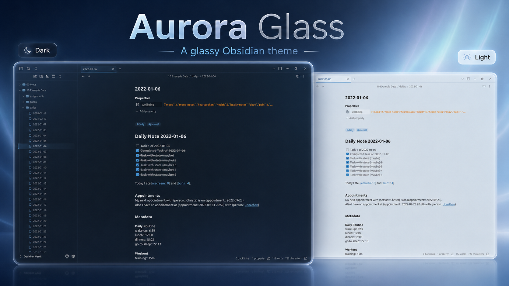

# Aurora Glass

Aurora Glass is a graphite-blue glass theme for Obsidian, customized on top of
Oczko24's Obsidian Transparent theme.

Repository: https://github.com/OtmiVi/aurora_glass

## Highlights

- Dark and light graphite-blue glass palettes.
- Transparent, gradient, solid-color, and custom-image background modes.
- Tuned settings modal, community theme browser, tabs, file explorer, graph,
  canvas, callouts, code blocks, marks, and inline code.
- Compatibility fixes for Make.md, MySnippets, Day Planner,
  Remotely Save, Notebook Navigator, and Enchanted Animations.

## Install

1. In Obsidian, open `Settings -> Appearance -> Themes`.
2. Click `Manage`, search for `Aurora Glass`, then click `Install and use`.
3. If it is already installed, select `Aurora Glass` from the theme dropdown.

## Fork notes (vvbzv)

Forked from `OtmiVi/aurora_glass` at `353dd68` and maintained here. Two changes on
top of upstream, both in `theme.css`:

1. **macOS: transparent window chrome.** Obsidian paints `.titlebar`,
   `.workspace-ribbon.mod-left::before`, `.titlebar-button-container.mod-right` and
   `.workspace-tabs.mod-top` with `--titlebar-background` / `--tab-container-background`.
   The opaque values hid `.app-container::before`, so the traffic-light corner and the
   top-right sidebar toggle stayed a flat patch instead of the gradient. Scoped to
   `body.mod-macos`; Windows/Linux chrome untouched. Offered upstream as PR #2.

2. **Static background by default.** The default (non-preset) backgrounds ran a 55s
   infinite `alternate` animation on `background-position` across seven layered
   gradients, on a fixed pseudo-element inset by `-2 * background-blur` (80px) and
   carrying `filter: blur(80px) saturate()`. `background-position` is not
   compositable, so that layer was repainted and re-blurred every rendered frame.
   GPU Device Utilization on an M2, Obsidian 1.13.6, idle window, 6 samples:

   | config | avg | max |
   | --- | --- | --- |
   | Obsidian closed | 22–33% | — |
   | another theme (Tokyo Night) | 30% | 39% |
   | upstream Aurora Glass | **90%** | 92% |
   | this fork | **29%** | 34% |

   The two `animation` lines are commented out, not deleted — uncomment for the
   ambient drift. Transform-based keyframes were measured at 74%, so the drift is off
   rather than rewritten.

Both changes revert by editing that one file.

## Credits

Based on Obsidian Transparent by Oczko24:
https://github.com/Oczko24/Obsidian-transparent

Customized and assembled by OtmiVi.
